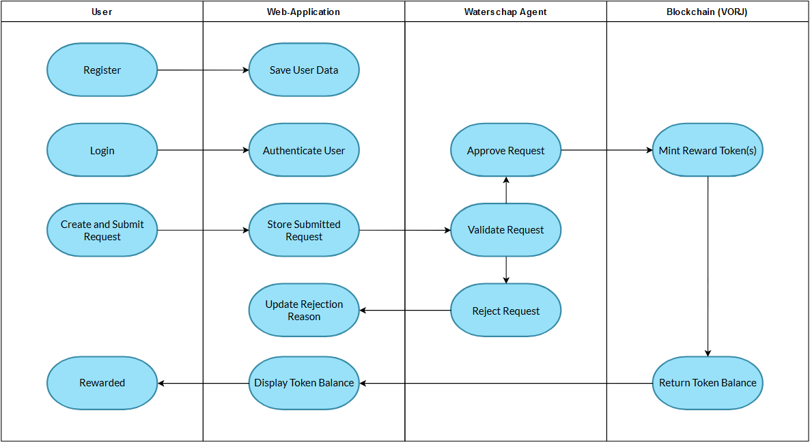

# Project Waterschap

## Introduction
The Netherlands is grappling with a concerning decline in groundwater levels due to factors such as prolonged dry periods and increased water consumption. This downward trend contributes to escalating water scarcity in dry seasons, resulting in very dry soil and a lack of vegetation. Simultaneously, short bursts of extreme rainfall amplify the risk of flooding and sewer overflows. In response, stakeholders are urgently seeking measures to retain more water and supplement groundwater. A pivotal strategy involves retaining rainwater within the built environment, facilitating its infiltration into the soil. This not only eases the burden on waterways during heavy rainfall, but also replenishes the groundwater supply. The project outlined herein strategically integrates blockchain technology to incentivize homeowners to embrace rainwater saving solutions. By doing so, our initiative aims to foster a sustainable water management paradigm, alleviating the impact of water scarcity and contributing to a resilient and eco-conscious society. This plan delineates a targeted approach to leverage blockchain's transformative potential for a more water-secure future.

## Description
Our project goal is to create a user-friendly web-application that incentivises households to implement water saving measures at their homes. Households will receive blockchain-based tokens, called Watertokens (WAT),  as a reward for their claim request that are approved . The application allows users to make new claim requests with the information for the water saving measure they implemented, such as the measure type(s) and value(s), and an image of the implemented measure. Initially, this could either be Rain barrels attached to the gutters of the household, or to install a Green roof on all or part of their rooftops. An agent (from the local waterschap) is then tasked with reviewing requests, and if all the information in a request is correct, it can be approved. Rewards are based on the value(s) of the measure(s) in the request, with Rain barrels being worth 1 Token for every 10 Liters in volume, and Green roofs being worth 2 Tokens for every 10 Square meters covered. However, if information in the request is incorrect, an agent can reject the request and will leave a reason as to why. Allowing the user the opportunity to make a new request that is correctly filled in.

## Installation

First setup the Backend of the project, to do so, follow the readMe in the backend directory. 
Once complete, setup the Frontend of the project, to do so, follow the readMe in the client directory.

## User Stories

### Front-end

- As a user, I want to be able to register for an account, log in, and manage my profile easily, so that I can access the application's features securely.
- As a user, I want the application to establish a reliable connection to the VeThorChain blockchain network, ensuring seamless interaction with blockchain functionalities.
- As a user, I expect the application to provide efficient mechanisms for recording and retrieving relevant data from the blockchain, ensuring accuracy and reliability in transactions and information retrieval.
- As a user, I want the water saving measure request information to be processed accurately and stored with the corresponding date, ensuring the data's relevance and usefulness.
- As a user, I expect the application to have endpoints for smooth communication with the front-end, facilitating seamless user experience and interaction.
- As a user, I want to perform CRUD (Create, Read, Update, Delete) operations on application-specific data effortlessly, ensuring full control over my information and interactions within the system.

---

### Back-end
- As a developer, I need to implement endpoints for user registration, login, and profile management, ensuring smooth user onboarding and interaction with the application.
- As a developer, I must establish a secure connection to the VeChainThor blockchain network, enabling seamless integration of blockchain functionalities into the application's back-end.
- As a developer, I need to develop robust mechanisms for interacting with the blockchain, ensuring reliable data recording and retrieval for various application functionalities.
- As a developer, I must process water saving measure requests from the user to prepare them for storage in the database.
- As a developer, I must ensure the presence of endpoints for communication with the front-end, enabling seamless interaction and data exchange between the front-end and back-end systems.
- As a developer, I must provide endpoints for CRUD operations on application-specific data, facilitating efficient data management and manipulation within the system.

---

### Database
- As a user, I want my authentication credentials to be securely managed, ensuring the safety of my account information.
- As a user, I want my personal information, such as address and contact details, to be stored securely in the database, safeguarding my privacy.
- As a user, I expect my water saving measure requests, along with the date, to be accurately stored in the database, ensuring the reliability and relevance of the data.
- As a user, I expect the database to support CRUD operations, enabling me to manage and update my information efficiently within the system.

---

### Blockchain
- As a user, I want the system to allow the creation of new tokens, providing flexibility, and for token-based functionalities.
- As a user, I expect tokens to be issued to me as rewards for completing specific tasks or actions, incentivizing my participation and engagement with the application.
- As a user, I want token issuance to be secure and tamper-proof, ensuring the integrity and reliability of the reward system.
- As a user, I want the system to maintain  an accurate record of my token holdings, enabling me to track my rewards effectively.
- As a user, I want to view my token balances easily, allowing me to monitor my rewards and transactions conveniently within the system.

## Visuals

Depending on what you are making, it can be a good idea to include screenshots or even a video (you'll frequently see GIFs rather than actual videos). Tools like ttygif can help, but check out Asciinema for a more sophisticated method.

### Swimlane Diagram: Interaction Flow 

**Description:**

The swimlane diagram illustrates the interaction flow between a User, the Web-Application, a Waterschap Agent, and the Blockchain (VORJ).

**User Lane:**

* **Register:** The User must first register on the platform.

* **Login:** The User can then login to the platform to access the create request functionality.

* **Request Creation & Submission:** If the User has installed a water saving measure at their house, they can create and submit a request that will be validated by a Waterschap Agent.

* **Rewarded:** Upon approval of a submitted request, the User is rewarded with Water Tokens (WAT), an ERC-20 token on the VeChain testnet.

**Web Application Lane:** 
* **Save User Data:** The User data is stored in the database after succesful registration.

* **Authenticate User:** When the User tries to log in, their credentials are authenticated before they are granted access to the application.

* **Store Submitted Request:** When a request is submitted, it is stored in the database and displayed to the Waterschap Agent.

* **Update Rejection Reason:** Update the request with the rejection reason added by the Waterschap Agent

* **Display Token Balance:** The User's Token balance is displayed on the homepage and the profile page

**Waterschap Agent Lane:**

* **Validate Request:** The Waterschap Agent is responsible for reviewing and validating the requests submitted by users.

* **Approve Request:** If all information in the request is correct, the Waterschap Agent may approve the request, the user is then rewarded with WaterTokens (WAT), an ERC-20 token on the VeChain testnet.

* **Reject Request:** If all information in the request is not correct, the Waterschap agent may reject the request, a reason must then be added for the User to be able to review and make adjustments.

**Blockchain (VORJ) Lane:**

* **Mint Reward Token(s):** Upon approval from the Waterschap Agent, the logic to reward the user with the appropriate amount of WAT tokens is executed on the Blockchain. (The reward value is based on the value(s) of the measure(s) implemented)

* **Return Token Balance:** Upon loading the homepage or profile page, the User's wallet balance is returned from the Blockchain to be displayed.

